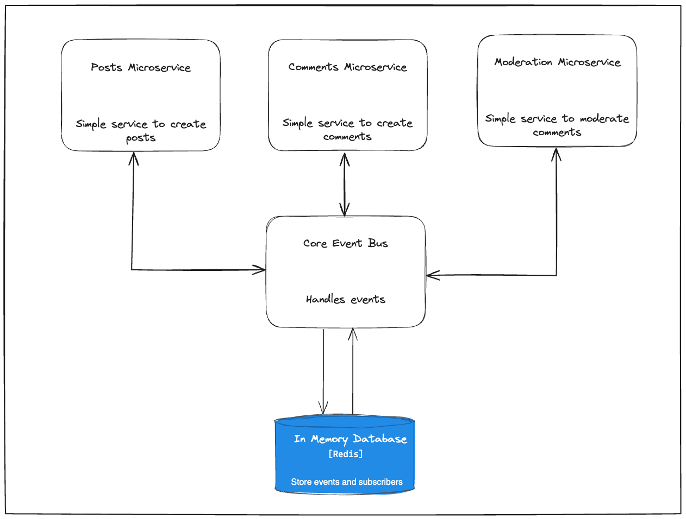

## Go Event Bus

### Introduction

This project serves as a simple event bus implementation to explore how an
event bus might work. The project simulates a microservices environment.
The event bus communicates over REST and follows the publisher subscriber model.

The goal of this project is not to create a production ready event bus, but to
explore how an event bus might work and create a simple rough implementation. The
design is as simple as possible.

>

### Background

In modern distributed systems architecture, event-driven communication plays a pivotal role in facilitating
asynchronous and decoupled interactions between various components.
Event buses serve as fundamental infrastructural components, enabling efficient pub/sub (publish-subscribe) messaging patterns.

### Requirements

- Services can subscribe to events of a certain type
- Services can publish events of a certain type
- Services can unsubscribe from events of a certain type
- Event history should be stored and available for inspection
- Users should be able to view subscribers by event type

### Design

### Limitations

- REST is slower than a long lasting tcp connection that uses a binary protocol
- No fault tolerance built in

### References

- Inspired by [Neetcode](https://neetcode.io/courses/lessons/design-youtube)

